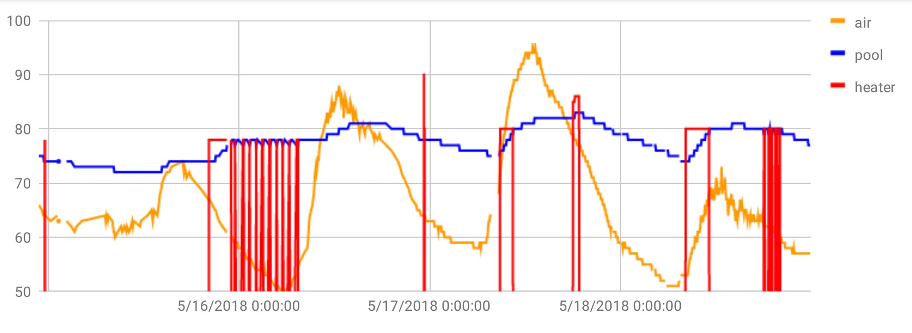

# pooltemp
Zodiak [iAquaLink](https://www.iaqualink.com/) pool temperature logger.

Let's me generate [graphs](https://docs.google.com/spreadsheets/d/1WyDgb0ElmgH-PU0MqPzu8AwGP-WzD_h82J59s1TwcVg/edit#gid=1826841541) like this:

Mostly a quick and dirty hack.  I used [Charles Web Debugging Proxy](https://www.charlesproxy.com/) to MITM the HTTPS session from the Android app and reverse engineer the protocol.
